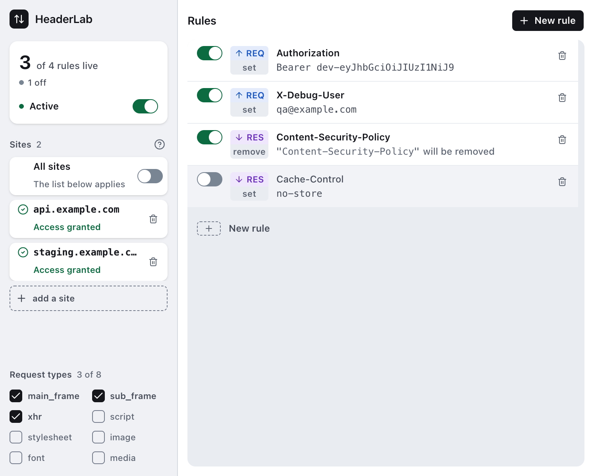
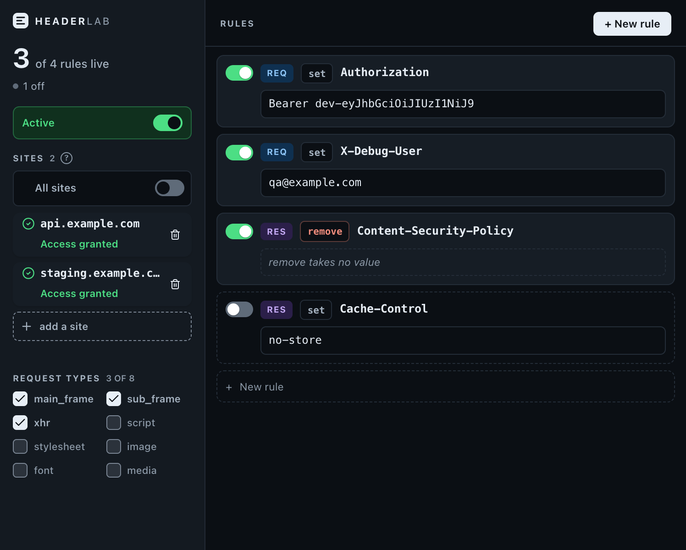
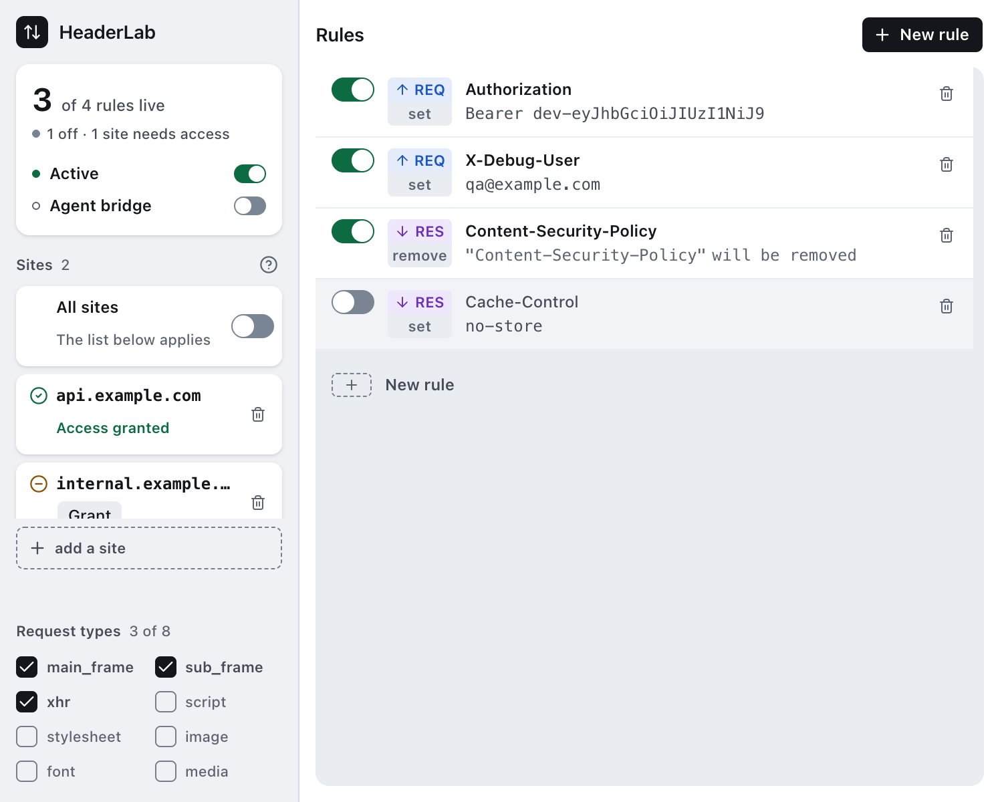
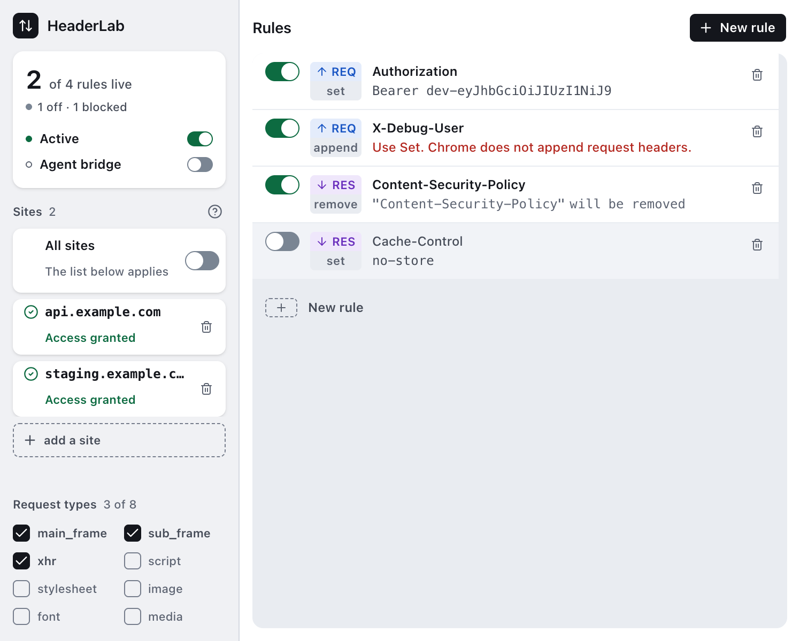

# HeaderLab

[English](../README.md) | [한국어](README.ko.md) | [日本語](README.ja.md) | [中文](README.zh.md) | Español

Añade, modifica y elimina cabeceras HTTP de petición y respuesta, en Chrome, sin ningún
acceso a sitios hasta que tú lo concedas.

[](https://github.com/say8425/headerlab/actions/workflows/ci.yml)
[](https://www.npmjs.com/package/headerlab)

| Claro | Oscuro |
|---|---|
|  |  |

## Instalación

No hay ficha en la Chrome Web Store. Toma el zip adjunto a la última
[release](https://github.com/say8425/headerlab/releases) y descomprímelo, o constrúyelo tú
mismo:

```bash
corepack enable          # pnpm viene del campo packageManager de package.json
pnpm install
pnpm build               # → .output/chrome-mv3
```

Después abre `chrome://extensions`, activa el **Modo de desarrollador**, elige **Cargar
descomprimida** y selecciona ese directorio. Solo Chrome — mira
[Limitaciones](#limitaciones).

### La CLI

```bash
npm i -g headerlab
```

Eso pone `headerlab` en tu PATH, para manejar la extensión desde una terminal — mira
[Puente para agentes](#puente-para-agentes). También funciona directamente desde un clon,
sin ningún paso de instalación, porque el paquete no tiene dependencias en tiempo de
ejecución: `node packages/headerlab/bin/headerlab.mjs`. Pero la línea de arriba es como lo
usa una persona, y el clon es lo que hace quien contribuye; el orden es deliberado.

### La skill para agentes

`packages/plugin` empaqueta la CLI como una skill para Claude Code y para Codex, desde un
único árbol `skills/` bajo dos manifiestos. Ninguno está publicado en un directorio, así
que ambos se instalan desde este repositorio:

```bash
# Claude Code
claude plugin marketplace add say8425/headerlab
claude plugin install headerlab@headerlab

# Codex
codex plugin marketplace add say8425/headerlab
```

La skill ejecuta `command -v headerlab` antes de que su propio contenido llegue al modelo,
de modo que la ausencia de la CLI llega como un hecho y no como una sorpresa a mitad de
tarea. **Informa `bridge-off` hasta que el puente se enciende.** Instalar la CLI
globalmente no es un requisito previo: el plugin lleva su propio shim hacia
`packages/headerlab`. Ejecutar además `npm i -g headerlab` tampoco genera conflicto — el
PATH resuelve primero la copia global.

Pídelo con tus propias palabras; la skill traduce la petición a la CLI:

```text
¿Qué está haciendo HeaderLab ahora mismo?
Añade una cabecera de petición X-Debug: on solo en staging.example.com
Deja de enviar la cabecera Referer en api.example.com
Pausa todas las reglas y luego vuelve a activarlas
¿En qué sitios se me permite modificar realmente?
```

La primera y la última son lecturas: `status`, `site ls`, `rule ls` y `state get` responden
sin escribir nada. Las tres del medio escriben, y conviene esperar un detalle: añadir un
sitio delimita el alcance de la regla, pero no concede acceso a ese sitio. Queda pendiente
hasta que pulses Grant en el popup, y la skill tiene indicado decirlo en lugar de dejar que
leas la escritura como si el sitio ya estuviera activo.

## Qué hace

- **Establece, añade o elimina** cualquier cabecera, del lado de la **petición** o de la
  **respuesta**. Chrome limita `append` a una lista de 21 cabeceras permitidas en las
  peticiones, y HeaderLab señala la regla que queda fuera de ella — lo cual importa más de
  lo que parece, porque Chrome rechaza el conjunto de reglas entero en lugar de regla por
  regla, así que una sola de esas detiene también todas las demás. Y no ocurre en silencio: el
  popup muestra el fallo de registro.
- **Ámbito por sitio.** Los sitios se emparejan por host: un puerto o una ruta se descartan
  al añadirlos, y el valor guardado es el valor que opera, así que lo que muestra el panel
  es lo que sale por el cable.
- **Aplicar en todas partes**, como un modo explícito y no como una lista de sitios vacía.
  Cuesta `<all_urls>`, y el interruptor no lo pide — lo pide el botón Grant que tiene al
  lado.
- **Filtrar por tipo de petición** — ocho de los tipos de recurso de Chrome, marcables uno a
  uno. `main_frame` viene activado, porque el valor por defecto de DNR lo excluye en
  silencio.
- **Pausar todo** con un interruptor. El icono de la barra se atenúa para acompañarlo, y se
  vuelve a aplicar cuando el service worker despierta.
- **Sigue el tema de tu sistema**, claro u oscuro, antes del primer pintado.

El acceso se pide por sitio, en la fila que nombra ese sitio — nunca como efecto colateral
de escribir un nombre de host o de accionar un interruptor. Hasta que pulsas **Grant**, la
fila está en ámbar y lo dice:



Cualquier cosa que impida que una regla salga se dice en la fila de esa misma regla, y se
cuenta en el panel. Aquí la segunda regla le pide a Chrome un `append` sobre una cabecera
de petición que no va a añadir — la fila dice cuál y qué hacer en su lugar, la lectura
marca **2 of 4 rules live · 1 off · 1 blocked**, y nada se mueve para hacerle sitio al
mensaje:



<sub>Capturado desde la build de producción real cargada en Chrome. Solo se parcheó el
manifiesto, para preconceder los dos hosts de ejemplo y poder fotografiar el estado
concedido sin un diálogo nativo de permisos.</sub>

## Postura de confianza

- **Ningún permiso de host en la instalación.** El campo `permissions` del manifiesto es
  exactamente `storage` y `declarativeNetRequestWithHostAccess`. También declara
  `optional_host_permissions: ["<all_urls>"]`, que por sí solo no concede nada — Chrome se
  niega a dejar que una extensión solicite un origen que nunca declaró, así que esa línea
  es lo que hace legal al botón Grant en tiempo de ejecución, no lo que lo hace
  innecesario. El acceso a sitios lo concedes tú, host por host, en tiempo de ejecución, y
  puede revocarse desde Chrome en cualquier momento.
- **Ninguna llamada de red.** Sin analítica, sin telemetría, sin configuración remota, sin
  pings de actualización. El bundle publicado nunca *llama* a una primitiva de red, y
  puedes comprobarlo tú mismo en lugar de creerlo:

  ```bash
  pnpm build
  grep -rE 'fetch\(|XMLHttpRequest|WebSocket|sendBeacon' .output/chrome-mv3
  ```

  Eso no devuelve nada. El patrón busca formas de llamada y de constructor a propósito: una
  búsqueda simple e insensible a mayúsculas de esas palabras aparece dieciséis veces
  en el bundle, y cada una de ellas es una cadena o un identificador y no una llamada — los
  `prefetchDNS`, `fetchPriority` y `dns-prefetch` de React DOM, y los literales
  `"xmlhttprequest"` y `"websocket"`. Esos dos son nombres de tipo de recurso de
  declarativeNetRequest, y llegan por vías distintas: `xmlhttprequest` es uno de los ocho
  que el popup ofrece como casillas (ahí etiquetado `xhr`), mientras que `websocket` solo
  existe como miembro del enum de quince tipos de recurso contra el que se valida el estado
  guardado. Se dice aquí
  para que encontrarlos se lea como algo esperado y no como una mentira descubierta.
- **Ningún content script.** No se inyecta nada en ninguna página. Las cabeceras las cambia
  el motor `declarativeNetRequest` de Chrome, que nunca entrega el contenido de las
  peticiones a la extensión.
- **Ningún recurso externo.** Sin CDN, sin fuentes web, sin imágenes remotas.
- **Ningún fallo silencioso.** Todo lo que impide que una regla salga se dice en pantalla —
  un permiso que falta, un nombre de host inservible, un nombre de cabecera que Chrome va a
  rechazar. Una regla que no se está aplicando siempre dice por qué.

## Puente para agentes

Un agente de IA puede manejar HeaderLab desde una terminal en lugar de que una persona
vaya haciendo clic por el popup:

```bash
headerlab site add staging.example.com
headerlab rule add --target request --op set --name Authorization --value "Bearer $TOKEN"
```

El puente está apagado hasta que una persona activa su interruptor en el popup, y la CLI no
puede conceder acceso a sitios ni encenderlo — Chrome acepta ambas cosas solo desde un
gesto del usuario. Nada sale de la máquina: CLI, host y extensión se encuentran en un
socket de dominio Unix en un directorio por usuario, nunca en un socket de red.

[`docs/agent-bridge.es.md`](agent-bridge.es.md) es todo ello — el protocolo, los comandos,
los códigos de salida, cómo encenderlo, y las cinco afirmaciones que conviene no
malinterpretar.

## Limitaciones

**Esto es una build de Chrome MV3 y nada más.** `wxt.config.ts` no declara ningún otro
objetivo, y no se ha ejecutado ninguna build en otro navegador. Edge es el mismo motor y
debería funcionar, pero nadie ha pasado la suite contra él.

La tabla de abajo es *el techo de plataforma con el que se toparía un port*, no una matriz
de compatibilidad — son los
[datos de compatibilidad de MDN](https://github.com/mdn/browser-compat-data) para las APIs
sobre las que está construida esta extensión, leídos en la versión en que cada navegador
las publicó por primera vez. La columna de Edge es `✓` y no un número porque BCD la
registra como `mirror` — sigue a la de Chrome:

| | Chrome | Edge | Firefox | Safari |
|---|---|---|---|---|
| Cabeceras de petición (`RuleAction.requestHeaders`) | 86 | ✓ | 113 | 16.4 |
| Cabeceras de respuesta (`RuleAction.responseHeaders`) | 86 | ✓ | 113 | **ninguna** |
| Concesión por sitio en runtime (`optional_host_permissions`) | 102 | ✓ | 128 | 15.5 |
| Reglas por pestaña (`RuleCondition.tabIds`) | 92 | ✓ | 113 | **ninguna** |
| Native messaging (`runtime.connectNative`) | 29 | ✓ | 50 | 14 (app contenedora) |

Dos de ellas merecen deletrearse:

- **Safari no puede modificar cabeceras de respuesta en absoluto.** Eso es la mitad de lo
  que hace esta extensión, así que un port a Safari sería un producto distinto y más
  pequeño, no el mismo recompilado.
- **El native messaging de Safari va hacia una app de macOS contenedora**, según el modelo
  documentado por Apple, y no hacia un manifiesto de host en disco. `headerlab bridge
  install` escribe exactamente ese manifiesto, así que allí no tiene dónde instalarse.

Las funciones deliberadamente no construidas todavía se siguen como issues:
[#30](https://github.com/say8425/headerlab/issues/30) un único conjunto de reglas ·
[#31](https://github.com/say8425/headerlab/issues/31) importar/exportar JSON ·
[#32](https://github.com/say8425/headerlab/issues/32) UI de bloqueo por pestaña ·
[#33](https://github.com/say8425/headerlab/issues/33) ámbito por regex ·
[#34](https://github.com/say8425/headerlab/issues/34) selector manual de tema.

## Arquitectura

```
lib/model/       tipos, esquema zod, valores por defecto, migraciones   puro
lib/compile/     AppState → reglas DNR + diagnósticos                   puro
lib/permissions/ origins.ts, audit.ts puros · probe.ts llama al navegador
lib/view/        modelos de vista del popup                             puro
lib/bridge/      protocol.ts (esquema de comandos), apply.ts (reducer),
                 query.ts (estado → StatusPayload)                        puro
lib/storage/     state.ts, session.ts, useAppState.ts
lib/sync/        ruleSync.ts (reconcile), icon.ts
components/      UI del popup
entrypoints/     background.ts, popup/
packages/        el puente para agentes, fuera del bundle de la extensión —
                 headerlab (la CLI más el host de native messaging,
                 publicado en npm), plugin. Cero dependencias, node:test,
                 su propio job de CI
```

**Toda la corrección vive en una capa pura que nunca importa `chrome.*`.** `compile()`
convierte el estado completo de la aplicación en reglas de declarativeNetRequest más una
lista de diagnósticos, y el popup ejecuta esa misma función sobre ese mismo estado — de
modo que lo que dice la pantalla y lo que se le dijo al navegador no pueden discrepar.

**Un único bucle de reconciliación.** Cada disparador — un cambio en el almacenamiento, el
arranque del worker, un permiso concedido o revocado — desemboca en `reconcile()` dentro de
`lib/sync/ruleSync.ts`, que recompila desde cero y reemplaza el conjunto de reglas entero.
Es idempotente, y no hay un segundo camino por el que el estado pueda colarse hacia abajo.

Esta forma es forzada, no elegida: `@webext-core/fake-browser` implementa
`declarativeNetRequest` y `permissions.*` como stubs que lanzan excepciones, así que probar
imitando al navegador no es viable. Hacer que el navegador sea irrelevante para la lógica
es la respuesta a eso.

Los documentos de diseño viven en `docs/superpowers/specs/`, y las restricciones de
plataforma medidas que hay detrás, en `docs/research/`.

## Desarrollo

```bash
pnpm dev             # servidor de desarrollo de WXT → carga .output/chrome-mv3-dev
pnpm check           # cuatro de los seis jobs de CI: tipos · lint · formato · unitarios
pnpm test            # wxt build && vitest run — tests unitarios, sin navegador
pnpm test:packages   # los paquetes del puente, bajo node:test — el glob de vitest
                     # no llega hasta ellos, así que es su propio job de CI
pnpm check:all       # pnpm check && pnpm test:packages
pnpm test:e2e        # construye los dos modos e2e y lanza playwright test
pnpm typecheck       # wxt prepare && tsc --noEmit
pnpm lint            # wxt prepare && oxlint --deny-warnings   (lint:fix arregla)
pnpm format:check    # oxfmt --check             (pnpm format para escribir)
pnpm build           # build de producción → .output/chrome-mv3
pnpm screenshots     # regenera las imágenes de este README desde el popup real
pnpm store:assets    # regenera las 28 imágenes de la Chrome Web Store → docs/store/assets/
```

**pnpm, no npm.** `package.json` nombra la versión exacta bajo `packageManager`, así que
`corepack enable` te da esa y no hace falta instalar nada más. No hay
`package-lock.json`; `pnpm-lock.yaml` es el lockfile desde el que CI instala con
`--frozen-lockfile`.

**Ejecuta `pnpm test`, no un `pnpm exec vitest run` pelado.** Varias suites hacen
aserciones contra la salida *construida*, y las herramientas peladas no construyen. Un
artefacto obsoleto ha producido tanto un verde falso que desactivó un guard en silencio
como un rojo falso que costó una hora, así que `tests/support/build.ts` detecta la
obsolescencia y falla indicando el comando a ejecutar.

**`pnpm test:e2e`, `pnpm screenshots` y `pnpm store:assets` necesitan un navegador que
Playwright no instala por defecto:**

```bash
pnpm exec playwright install --with-deps --no-shell chromium
```

`--no-shell` importa. La descarga headless por defecto de Playwright es
`chromium-headless-shell`, una build recortada que no puede cargar extensiones — y esos dos
comandos existen precisamente para cargar una. Sin el binario completo fallan de una forma
que parece un problema de código y no una dependencia que falta.

**`pnpm screenshots` y `pnpm store:assets` sobrescriben los PNG versionados** — de
`docs/screenshots/` y `docs/store/assets/` respectivamente, y el segundo vacía su
directorio antes de reescribir las 28. Ese es su trabajo, pero significa que una ejecución
deja cambios en `git status`; haz commit de ellos solo cuando la UI haya cambiado de verdad.

**La build de e2e lleva un permiso de host que la build publicada no tiene, y dada la
primera afirmación de esta página merece decirse en voz alta.** `pnpm test:e2e` construye
en `.output/chrome-mv3-e2e` y `.output/chrome-mv3-bridge-e2e`, junto al directorio de
producción. El primero declara `http://127.0.0.1/*` (`wxt.config.ts`) para que la suite
pueda usar un servidor de eco local sin un diálogo en tiempo de ejecución que Playwright no
puede pulsar, y el segundo concede `nativeMessaging` directamente.
`tests/unit/manifest.test.ts` afirma que ninguno de los dos llega nunca a producción, y
ejecutar la suite e2e no toca `.output/chrome-mv3` — usa `pnpm build` para una build de
producción fresca.

`../CLAUDE.md` lleva el resto: por qué `lint` encadena `wxt prepare`, por qué
`postinstall` puede no ejecutarse nunca, qué formatea y qué no formatea oxfmt, y las
trampas de plataforma que ya le han costado tiempo a alguien.

## Tests

Tres capas: lógica pura sin navegador, adaptadores movidos por spies puestos a mano, y
end-to-end contra una extensión realmente cargada. Dos de los tests e2e ponen una petición
real en el cable a través de un servidor de eco local y leen las cabeceras de vuelta — son
la evidencia más fuerte del repositorio. El puente tiene los suyos, incluido uno que lleva
un `headerlab site add` real a través de un host realmente instalado, a través del socket,
hasta el almacenamiento real.

`packages/headerlab` aporta una suite propia, ejecutada por el runner de tests incorporado
de Node y no por vitest, porque ese paquete no tiene dependencias y no debería adquirir
ninguna. El glob de `vitest.config.ts` no llega hasta ellos, que es por lo que tienen un job
de CI propio: durante un tiempo se estuvieron mergeando sin ejecutarse, y una suite que
nadie ejecuta es peor que una que no existe, porque informa de éxito.

## Licencia

Apache-2.0. Mira [LICENSE](../LICENSE).
